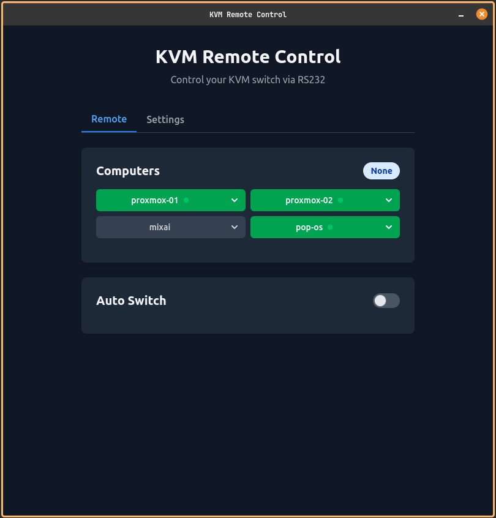
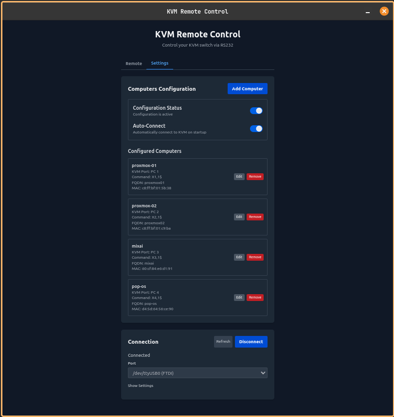
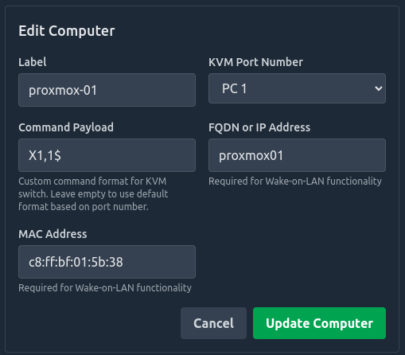
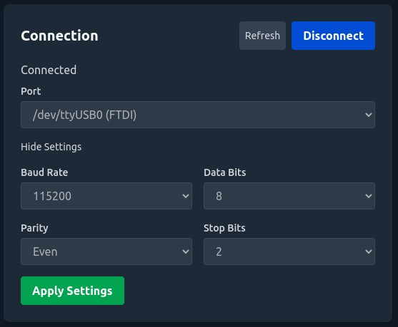

# KVM Control - User Guide

## Overview

KVM Control is a desktop application that allows you to control your RS232-capable KVM switch from your computer. It provides an easy-to-use interface for switching between connected computers, configuring your setup, and even supports Wake-on-LAN functionality to power on your computers remotely.

## Application Interface

### Remote View
The Remote view is where you control your KVM switch in daily use:

1. **Computer Buttons**: Click these to switch to the corresponding computer
2. **Active Computer Indicator**: Shows which computer is currently selected
3. **Online Status Indicator**: Green dot shows computers that are powered on
4. **Auto Switch Controls**: Enable automatic switching between computers
5. **Switch Timer**: Shows time until next automatic switch

### Settings View
The Settings view is where you configure your setup:

1. **Computer Configuration**: Add, edit, and remove computers
2. **Connection Settings**: Configure your serial port connection
3. **Configuration Status**: Enable/disable your configuration
4. **Auto-Connect Toggle**: Set the application to connect automatically on startup

## Features

- Control your KVM switch over an RS232 serial connection
- Switch between computers with a single click
- Automatic switching between computers at configurable intervals
- Wake up computers remotely using Wake-on-LAN
- Monitor the online status of your computers
- Fully customizable serial port settings
- Auto-connect on application startup

## System Requirements

- Windows, macOS, or Linux
- Available USB or Serial port for connecting to your KVM switch
- RS232-capable KVM switch with appropriate cable

## Installation

### Windows
1. Download the latest `KVM-Control-Setup.exe` from the releases page
2. Run the installer and follow the on-screen instructions
3. Launch KVM Control from the Start menu or desktop shortcut

### macOS
1. Download the latest `KVM-Control.dmg` from the releases page
2. Open the DMG file and drag the application to your Applications folder
3. Launch KVM Control from your Applications folder

### Linux
1. Download the latest `KVM-Control.AppImage` from the releases page
2. Make the AppImage executable: `chmod +x KVM-Control.AppImage`
3. Run the application: `./KVM-Control.AppImage`

## Getting Started

1. Connect your KVM switch to your computer using an RS232 cable
2. Launch KVM Control
3. Go to the Settings tab
4. Add your computers in the Computer Configuration section
5. Configure your serial connection in the Connection section
6. Click Connect to establish a connection to your KVM switch
7. Switch to the Remote tab to start controlling your KVM switch

## Configuration

### Setting Up Computers

1. In the Settings tab, click "Add Computer"
2. Enter a label for the computer (e.g., "Home PC" or "Work Laptop")
3. Select the KVM port number that the computer is connected to
4. Optionally, enter the computer's network hostname/IP address and MAC address for Wake-on-LAN functionality
5. Click "Add Computer" to save

#### Computer Configuration Options

- **Label**: A friendly name for your computer
- **KVM Port Number**: The physical port on your KVM switch where this computer is connected
- **Command Payload**: The format of the command sent to the KVM switch (advanced)
- **FQDN or IP Address**: Network address for status monitoring
- **MAC Address**: Physical address needed for Wake-on-LAN functionality

### Configuring Serial Connection

1. In the Settings tab, select your serial port from the dropdown menu
2. Configure serial port settings (baud rate, data bits, parity, stop bits) according to your KVM switch documentation
3. Click "Connect" to establish the connection

#### Connection Settings Explained

- **Port**: The serial/COM port your KVM switch is connected to
- **Baud Rate**: Speed of communication (typically 9600)
- **Data Bits**: Number of bits per transmission (typically 8)
- **Parity**: Error checking method (typically None)
- **Stop Bits**: Number of bits indicating end of byte (typically 1)

### Auto-Connect Setup

1. In the Settings tab, toggle "Auto-Connect" to enable automatic connection on startup
2. The application will now automatically connect to your KVM switch when launched

## Using the Application

### Switching Between Computers

In the Remote tab:
1. Click on the button corresponding to the computer you want to switch to
2. The active computer will be highlighted in blue

- **Blue Button**: Indicates the currently active computer
- **Green Button**: Indicates a powered-on computer that is not currently active
- **Gray Button**: Indicates a computer that is powered off or not detected on the network
- **Dropdown Menu**: Click the arrow to access additional options for each computer

### Using Auto-Switching

1. In the Remote tab, toggle "Auto Switch" to enable
2. Use the slider to set the interval between switches (5 seconds to 5 minutes)
3. The application will automatically switch between your configured computers at the set interval

The timer display shows the remaining time until the next automatic switch occurs. You can disable auto-switching at any time by toggling the switch off.

### Using Wake-on-LAN

1. In the Remote tab, click the dropdown arrow on a computer button
2. If the computer is offline and has a MAC address configured, click "Wake Up"
3. The application will send a Wake-on-LAN packet to the computer

The status indicator will update once the computer comes online, which may take 15-30 seconds depending on your computer's boot time.

## Troubleshooting

### Connection Issues

1. Check that your serial cable is properly connected
2. Verify that the correct port is selected in the Settings tab
3. Ensure that the serial port settings match your KVM switch requirements
4. Try refreshing the available ports list

### Computer Switching Issues

1. Verify that your KVM switch accepts RS232 commands
2. Check the command format in the computer configuration
3. Ensure that the port numbers in your configuration match your KVM switch ports

### Wake-on-LAN Issues

1. Verify that the MAC address is correctly entered
2. Ensure that the computer has Wake-on-LAN enabled in its BIOS/UEFI settings
3. Check that your router allows broadcast packets for Wake-on-LAN